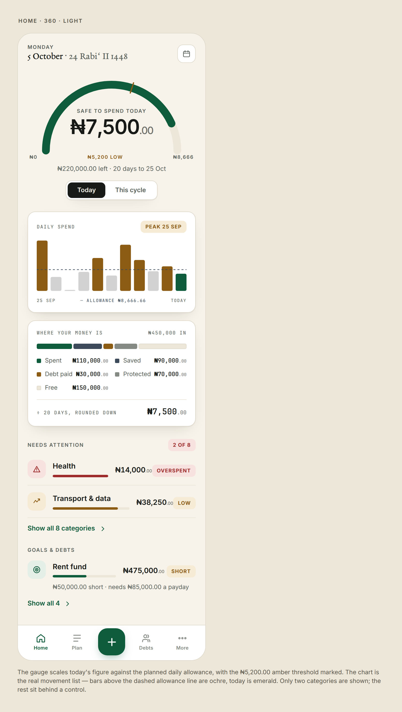
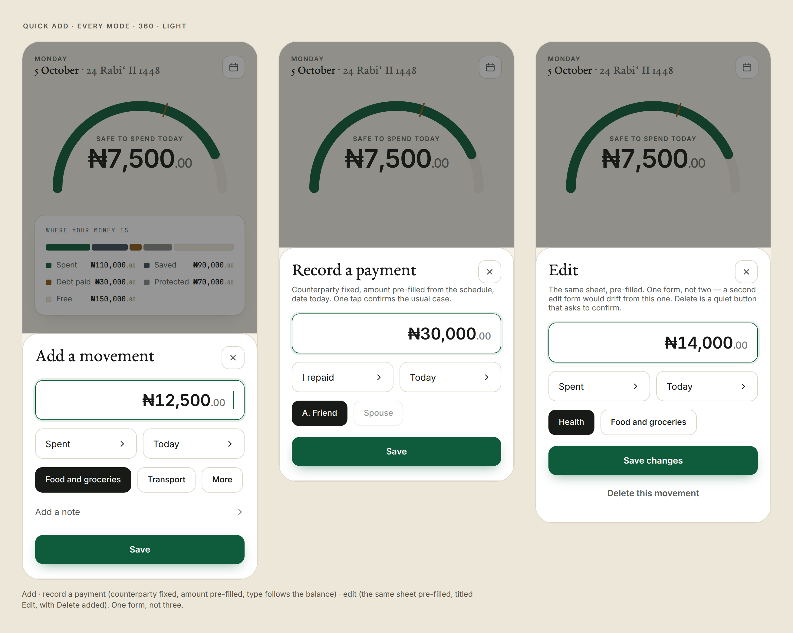
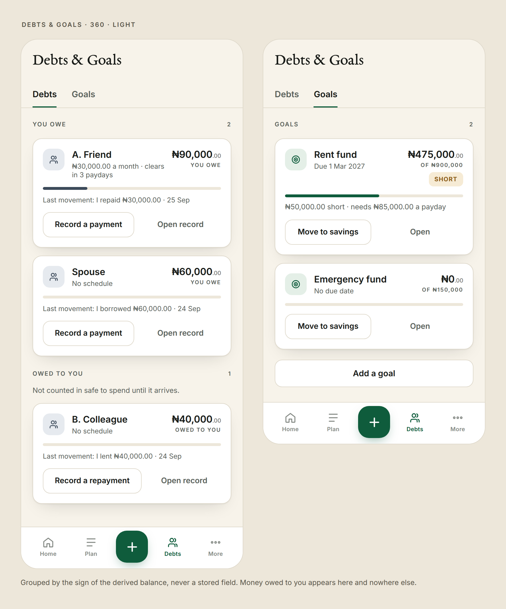
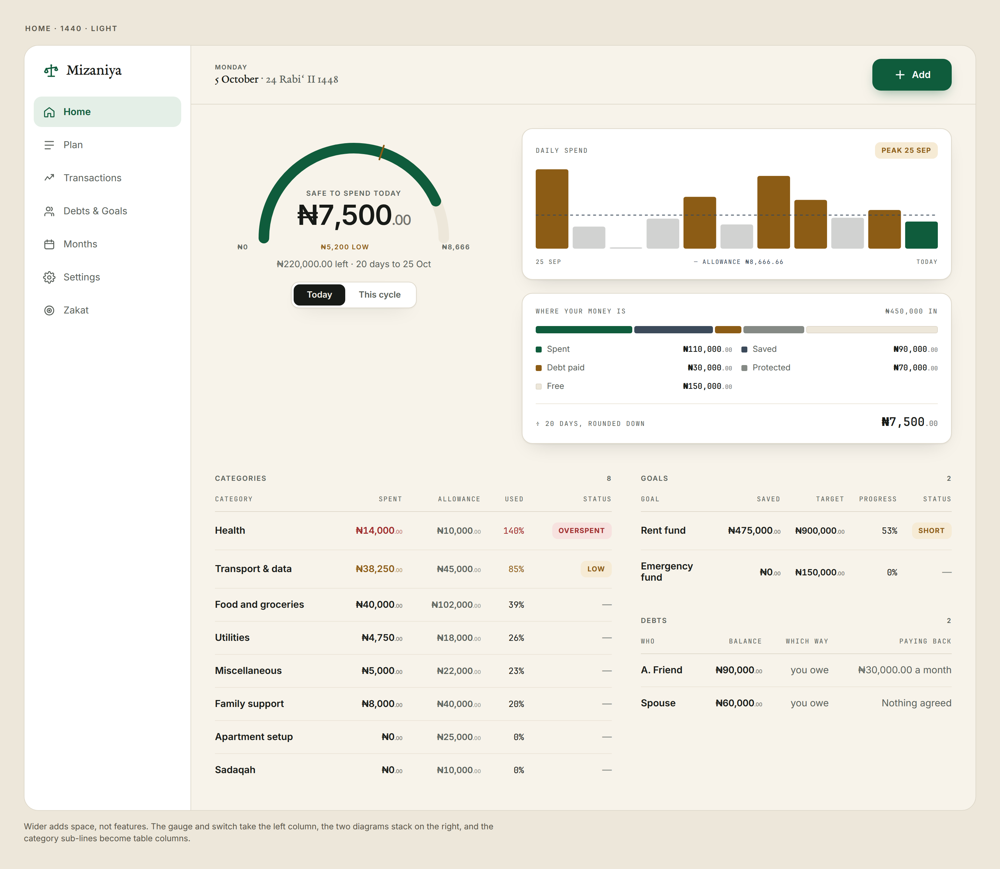

<p align="center">
  
  
</p>

<p align="center"><strong>Know what you can spend today.</strong></p>

<p align="center">
  Budgeting by salary day, not by calendar month.<br>
  Debts in both directions, a sinking fund for rent, and a zakat estimate when you want one.
</p>

---

## The problem

Three things break an ordinary budgeting app for a salaried household in Lagos.

**The salary arrives on the 25th, not the 1st.** Every app assumes a calendar
month, so the last week of one month and the first of the next belong to the
same pay packet but land in different reports. You can never answer *how much is
left* without doing arithmetic in your head.

**Money is owed in both directions.** You owe a friend ₦120,000 and a colleague
owes you ₦40,000. Most apps model one side. The money you lent has genuinely
left your account, and the money owed to you cannot buy food today — but a
rotating *ajo* passes through zero in both directions over its life, and it is
one relationship, not two.

**Rent is due once a year.** A ₦900,000 bill in March is not a March problem. It
is a problem every month from now until then, and you find out too late if
nothing is counting.

Mizaniya answers one question before it answers any other: **what can I spend
today, and is that figure in trouble?**

---

## What it looks like

|  |  |
|---|---|
| **Home** — one figure, ranked above everything else | **Quick Add** — a spend recorded in three taps |
|  |  |

| **Debts, both directions** | **Desktop** |
|---|---|
|  |  |

Every screen exists in light and dark, at 360px and 1440px, in every state —
67 artboards in [`docs/design/`](docs/design/).

---

## How it works

**Transactions are the only facts. Everything else is a calculation.**

That single idea decides most of the architecture. Nothing derived is ever
stored, so a figure on screen cannot quietly disagree with the movements that
produced it. Safe-to-spend, the projected gap on a goal, a debt balance, the
zakat estimate — all of them are pure functions of `(snapshot, now)`.

It also makes the app's strongest guarantee almost free: **export the data,
import it into a clean browser, and every figure is identical.** There is a test
that asserts exactly that, on the figures rather than on the rows.

A few decisions that carried the most weight:

| Decision | Why |
|---|---|
| **Money is integer kobo** with a branded `Kobo` type | Floating point cannot represent decimal money. Rounding direction lives in the function name — `perUnitFloor` for money you may spend, `perUnitCeil` for money you must find |
| **Time is a parameter.** `core/` never reads the clock | Every cycle calculation is testable against a fixed date, and a February bug can be reproduced on purpose |
| **A debt stores no direction** | A rotating *ajo* crosses zero. A stored direction would need correcting at the crossing, and nothing would notice if it were not |
| **Rollover carries the allowance, not the money** | The unspent ₦12,000 never left the account. What rolls over is *permission*, not cash — and a test asserts cash left is identical with rollover on and off |
| **Writes go to storage first, memory second** | A rejected save leaves the screen showing exactly what the database holds, instead of a figure that only exists on screen |
| **Local-first, no accounts, no network** | Financial records on someone's phone. There is no server to leak them from |

The long form is in [`docs/02-architecture.md`](docs/02-architecture.md) and the
[ADRs](docs/adr/), each with the alternatives that were rejected and why.

---

## Built in the open, to a written standard

This repository is also a record of *how* it was built.

- **[`docs/standards/`](docs/standards/)** — the engineering rulebook the code is
  held to, section by section. Every rule is marked `auto` (a linter, the
  compiler or CI fails the build) or `review` (a human has to look).
- **The architecture boundaries are machine-checked.** `core/` imports nothing;
  `ui/` may not reach the store; the app may not reach the database.
  [`src/architecture.test.ts`](src/architecture.test.ts) injects a violation into
  each layer and **requires ESLint to report it** — because a lint rule that has
  only ever passed is indistinguishable from one that is switched off.
- **[`CONTEXT.md`](CONTEXT.md)** — every decision, with its date, its reasoning
  and the option that was rejected. Including the ones that turned out wrong.
- **No real financial data anywhere.** Every figure in the code, the tests, the
  documentation and the screenshots comes from
  [`docs/seed-data.md`](docs/seed-data.md), and it is invented.

---

## Running it

```bash
npm install
npm run dev      # http://localhost:5173
npm run verify   # naming, lint, typecheck, tests, production build
```

`npm run verify` is the gate. Nothing is "done" until it is green.

---

## Where it is

**Cycle 1 is complete** — the domain layer and the data seam beneath it. **Cycle 2
is in progress** — the shell, onboarding, Home.

| | |
|---|---|
| `src/core/` | Money, cycles, budget, rollover, debts, goals, zakat. Framework-free, imports nothing |
| `src/data/` | The `Repository` over IndexedDB. The only place Dexie is named |
| `src/store/` | One snapshot, one write path, memoised selectors |
| `src/ui/` | ~25 primitives, every state, built from the design tokens |
| `src/features/` | Onboarding, Home |

**288 tests.** Every figure the documentation publishes is pinned by one, because
those numbers appear in the specs and on 67 artboards, and nothing else would
notice them drifting apart.

Still to come: Plan, Transactions, the printable debt record, Months, Settings,
Zakat, and CI.

---

## Licence

[PolyForm Noncommercial 1.0.0](LICENSE). Source-available: read it, learn from
it, build on it — but not commercially.
