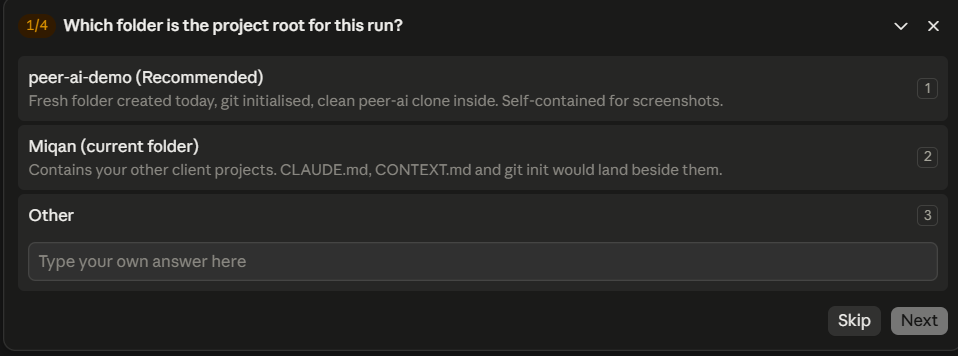
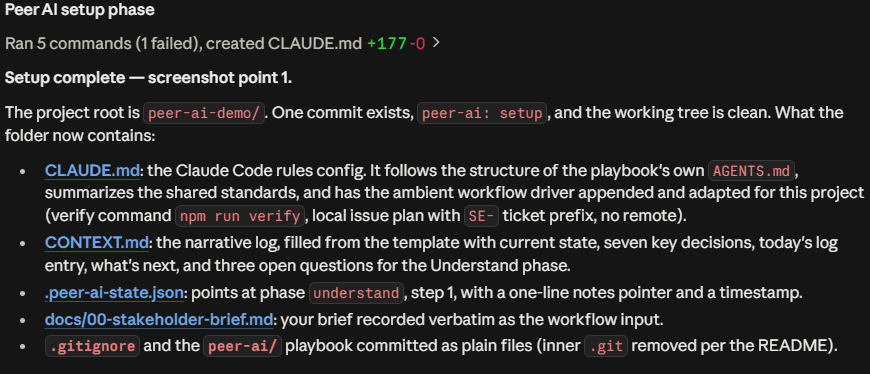
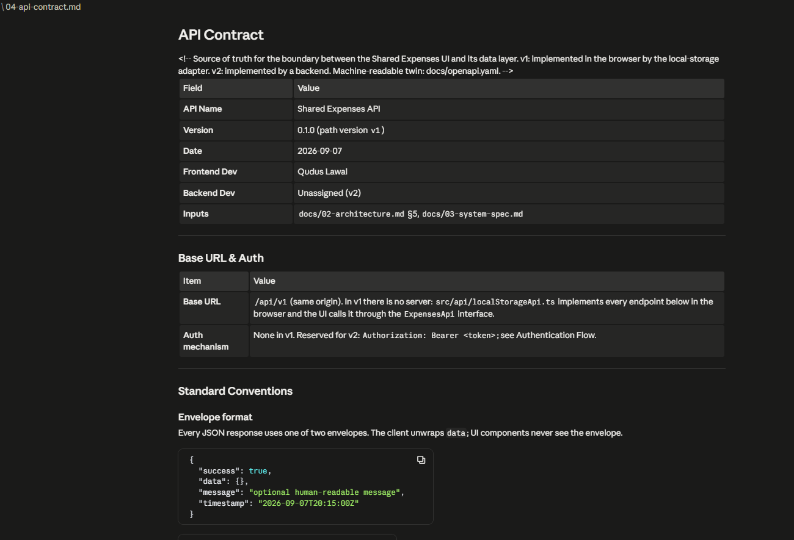
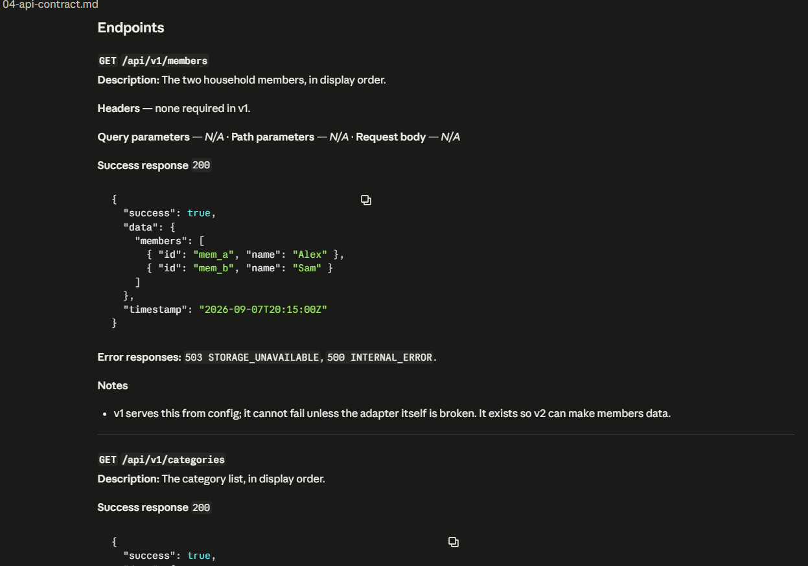
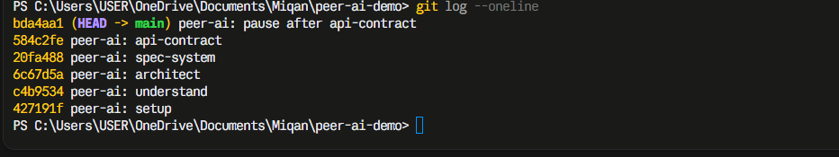
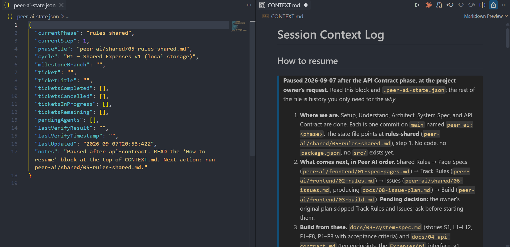

# Peer AI

A portable, agent-agnostic workflow for AI-assisted software development — from a stakeholder's email to a tested, documented app.

Peer AI is a set of plain Markdown files. Each one tells an AI coding agent how to run one phase of a build, what document or code it must produce, and where to stop and ask. The agent is interchangeable. The process is not.

---

## Why it exists

Ad-hoc prompting drifts. Every chat starts from nothing, the agent re-decides things that were settled last week, and the result depends on who happened to be typing. Peer AI replaces that with twelve phases that run in a fixed order, each producing a document the next phase reads first and each pausing for your confirmation at every step. Four specialised agents (code review, contract check, security audit, QA) run at fixed handoff points instead of whenever someone remembers. Two files at the project root, `CONTEXT.md` and `.peer-ai-state.json`, carry the decisions and the current position across sessions, so a fresh chat picks up exactly where the last one stopped. It was built for a product team and has been used on every build since.

---

## See it working

Screenshots from a run on a small shared-expenses app using Claude Code, paused after phase 4.



*Setup gate. Before a single file is written, the agent asks and waits, starting with which folder is the project root.*



*Setup detects the tool and writes its config. Here that is `CLAUDE.md`, with the workflow driver appended, alongside `CONTEXT.md`, `.peer-ai-state.json` and the stakeholder brief, all in one commit.*



*Phase 4 output, the top of `docs/04-api-contract.md`: who owns each side of the boundary, which earlier documents fed it, and the envelope every response uses.*



*Further down the same file. Each endpoint carries its exact response shape, error codes and notes, agreed before any code exists.*



*One commit per phase. The git log reads as the workflow: setup, understand, architect, spec-system, api-contract.*

<!-- TODO: docs/screenshots/03-code-review.png is not captured yet. Replace this block with the image and a one-line caption. -->
> **Screenshot to follow:** `03-code-review.png`, the code review agent's findings at the end of Build.



*The two continuity files. Left: the state file points at phase, step and file, with a one-line `notes` pointer. Right: `CONTEXT.md` holds the narrative, here a "How to resume" block written when the run was paused.*

---

## The twelve phases

Phase 0, Setup (`shared/00-setup.md`), runs once per project. It detects the AI tool, writes its rules config, and creates the two continuity files. After that, twelve phases run in order. Every phase file opens with the model it runs on — in this copy, Opus for build and Fable for everything else, never downgraded mid-phase — works step by step with a wait for your input at each step, and ends by handing off to the next file. All but the journal phase also update `.peer-ai-state.json` and `CONTEXT.md` before handing off.

1. **Understand** (`shared/01-understand.md`) produces `docs/01-requirements-summary.md`: what is being built, a scope table (in, out, unclear), dependencies, questions for the stakeholder, and recorded assumptions. Nothing is architected until you have confirmed the summary.
2. **Architect** (`shared/02-architect.md`) produces `docs/02-architecture.md`: components, end-to-end data flows, the chosen pattern and its trade-offs, API conventions, cross-cutting concerns, and ADRs. The next phase opens by reading it.
3. **System Spec** (`shared/03-spec-system.md`) produces `docs/03-system-spec.md`: overview, roles and permissions, MoSCoW user stories, Given/When/Then acceptance criteria, data requirements and non-functional requirements. The API contract is extracted from it.
4. **API Contract** (`shared/04-spec-api-contract.md`) produces `docs/04-api-contract.md`, optionally with `docs/openapi.yaml`: response envelope, auth flow (or an explicit note that this version has none), exact JSON per endpoint, error codes. Neither frontend nor backend starts building until both have agreed it.
5. **Shared Rules** (`shared/05-rules-shared.md`) produces `docs/05-coding-standards.md`: Git and PR conventions, environment files, type strictness, naming, linting, documentation, security baseline, dependency pinning. Work then splits into a frontend or backend track.
6. **Page or Endpoint Specs, then Track Rules** (`frontend/01-spec-pages.md` and `frontend/02-rules.md`, or `backend/01-spec-endpoints.md` and `backend/02-rules.md`) produce `docs/06-page-specs.md` and `docs/07-frontend-coding-rules.md`, or `docs/backend-endpoint-specs.md` and `docs/backend-coding-rules.md`. Every page, or every endpoint group, is specified with its states and errors before any ticket is written.
7. **Issues** (`shared/06-issues.md`) produces `docs/08-issue-plan.md`: tickets grouped Foundation, Feature, Testing and Documentation, each with acceptance criteria, priority and size, plus a dependency map, critical path and cycle plan. Build takes its tickets from this plan.
8. **Build** (`frontend/03-build.md` or `backend/03-build.md`) produces working code one ticket at a time. The frontend builds every page against typed mocks of the contract, then swaps in real APIs group by group and runs a design-quality pass; the backend goes foundation, auth, endpoint groups, integrations, migrations, then jobs, webhooks, files, caching, real-time and hardening as specified. Each ticket ends with the project's verify command and an issue-tracker update, and the phase ends by offering the code review and contract check agents.
9. **Review** (`frontend/04-review.md` or `backend/04-review.md`) produces findings category by category (functionality, code quality, security, accessibility, performance, error handling, contract compliance and the rest), a Critical / Warning / Info rollup, and fixes you approve. It does not call the code clean while Critical findings stand, and it ends by offering the security audit and code review agents.
10. **Test** (`frontend/05-test.md` or `backend/05-test.md`) produces the automated suite: unit, component or integration, end-to-end and contract tests, plus forms, accessibility and i18n on the frontend or database, jobs, webhooks, files and real-time on the backend, then a full run, fixes and a coverage summary. It ends by handing off to the QA agent.
11. **Document, then PR Automation** (`shared/07-document.md`, then `shared/09-pr-automation.md`) updates the project README, `CHANGELOG.md` in Keep a Changelog format, ADRs under `docs/adr/`, the API contract, a stakeholder update and handoff notes; then writes `.github/workflows/pr-checks.yml`, branch-protection steps and, optionally, an AI review action and commit-message checks. A new cycle returns to phase 1 or phase 7.
12. **Dev Journal** (`shared/08-dev-journal.md`) sets up the journal (Notion via MCP, local Markdown under `docs/journal/`, another tool, or none) and records the choice in `docs/journal-config.json`; at the end of a cycle it reads every entry and writes a retrospective. During the cycle, the other phases offer entries at key decisions and at each handoff.

Two rules apply throughout. When a mockup and the API contract disagree, the contract wins on data and the design wins on visuals (`shared/design-data-contract.md`). Whenever a phase saves a document to `docs/`, it offers a PDF-ready HTML copy in `docs-pdf/` (`shared/rules/docs-pdf-export.md`).

---

## Agents

Four prompt files in `agents/`. Each is a role, a checklist and a fixed output format, and each opens with a model recommendation. They are offered automatically at the handoffs below and can be run at any time with `Follow peer-ai/agents/<file>`.

### Code review (`agents/review-prompt.md`)

**When:** offered at the end of Build, before Review, and again at the end of Review, before Test. The optional PR review action from phase 11 runs this same prompt against each pull request diff.

**Checks:** naming, structure, duplication and complexity; strict typing with no unjustified `any`; secrets in source, XSS, SQL injection and missing auth checks; error handling and safe user-facing errors; re-renders, N+1 queries and heavy imports; calls and shapes against the API contract; tests for changed code; branch, commit and PR conventions; mock layers labelled as mock.

**Output:** a JSON array of findings, each with file, line, severity (`critical`, `warning`, `info`), category, issue and suggestion.

### Contract check (`agents/contract-check-prompt.md`)

**When:** suggested during the frontend build as soon as the last mock service has been swapped for a real API, and offered at the end of both builds. It needs the contract, the frontend service files and the backend route files in the same context.

**Checks:** every contract endpoint exists in the backend and every frontend call exists in the contract; query parameters, bodies and headers; response fields, types and nullability; status codes and error bodies, and that the frontend handles them; auth required, enforced and sent; pagination strategy and parameter names; date and ID formats.

**Output:** a table of endpoint, check, status (`match`, `mismatch`, `missing`) and details, followed by counts of mismatches and missing endpoints.

### Security audit (`agents/security-audit-prompt.md`)

**When:** offered at the end of Review, before Test. It runs on the same model as every other non-build phase — a security audit on a deliberately weakened model is a false reassurance.

**Checks:** authentication (token validation, storage, refresh, expiry, password hashing, login rate limits); authorisation on every protected route, including IDOR; server-side validation and upload limits; output encoding and CSP; HTTPS, HSTS and cookie flags; dependency CVEs and lockfile integrity; secrets, debug mode and source maps in production; stack traces and PII in responses and logs; CORS, rate limiting and security headers.

**Output:** a findings table (category, severity from `Critical` to `Low`, location, issue, remediation) and an overall risk rating with the top one to three remediations.

### QA (`agents/qa-prompt.md`)

**When:** offered at the end of Test, before Document. It reads the page or endpoint spec and the ticket's acceptance criteria as the definition of done.

**Checks:** every acceptance criterion is testable and mapped to a case; the happy path; error states (API down, invalid input, unauthorised, empty data); edge cases (long strings, unicode, double submit, large datasets); role-based access; responsive breakpoints; keyboard, screen reader and contrast.

**Output:** a test matrix (test case, steps, expected result, status `pass`, `fail` or `untested`, notes) followed by suggested Playwright and API tests.

---

## Works with

The workflow files never assume a tool. Setup asks which one you use and writes the matching always-on rules config. The rule content is the same in every case; only the filename and location change. The sources are plain `.md` files in `shared/rules/`, `frontend/rules/` and `backend/rules/`.

| Tool | What setup writes |
|------|-------------------|
| **Cursor** | `.cursor/rules/shared.mdc`, `.cursor/rules/workflow-driver.mdc` and `frontend.mdc` or `backend.mdc`, copied from the source rules and renamed to `.mdc` so Cursor auto-loads them. `docs-pdf-export.mdc` is optional. |
| **Claude Code** | `CLAUDE.md` at the project root: states that the project uses Peer AI, summarises the shared standards, instructs reading `.peer-ai-state.json` and `CONTEXT.md` at session start, and lists the phase files. Modelled on this repo's `AGENTS.md`. |
| **Codex**, and any agent that reads `AGENTS.md` | `AGENTS.md` at the project root, modelled on this repo's own `AGENTS.md` and scoped to the project. |
| **Copilot**, **cloud agents** and other tools with a rules or memory file | Setup asks which file the tool reads and writes the same content there. |
| **ChatGPT** and other chat tools with no rules file | Nothing is written. Open the phase file, paste it as instructions, and paste `shared/rules/shared.md` as context. |

The ambient workflow driver, `shared/rules/workflow-driver.md`, is what lets the agent continue from the state file without being told which phase to follow. Setup copies it as `.mdc` for Cursor and appends its body to the config file for every other tool, then fills in its project settings table with you: verify command, issue tracker and ticket prefix, remote, design reference, and branch naming. Write `none` for a missing remote or tracker and the driver skips the matching push and tracker steps, so a solo local project works too.

Agent prompts also run outside an editor: attach `agents/review-prompt.md` to an issue for a cloud agent, or pass it with the diff to an AI API from a GitHub Action, which is what the optional review workflow in phase 11 does.

---

## How to use it

### 1. Add Peer AI to your project

Clone it into a `peer-ai/` folder at the project root, then remove its `.git/` so it is committed as plain files rather than as a nested repository:

```bash
mkdir my-app && cd my-app
git init
git clone https://github.com/AbuMahir980/peer-ai.git peer-ai
rm -rf peer-ai/.git
```

If you skip the last line, `git add` records `peer-ai/` as an empty gitlink and the playbook never lands in your repo; setup checks for this and removes a leftover `.git/` if it finds one. `peer-ai/` must sit at the project root, not inside `src/` or another subfolder; every phase file refers to `peer-ai/...` paths from there.

### 2. Run setup once

Open the project in your AI tool and type:

```
Follow peer-ai/shared/00-setup.md
```

Setup confirms the folder, asks which tool you use and the project basics in a single round of questions, writes the tool's config with the workflow driver appended, copies the two continuity files to the project root and fills them and the driver's project settings in, then offers the optional dev journal and PDF export. A fast model is enough; scaffolding does not need a premium one.

### 3. Follow the phases

With the workflow driver installed, the agent reads `.peer-ai-state.json` at the start of each session and continues from the recorded phase and step. You can also invoke any phase directly:

```
Follow peer-ai/shared/01-understand.md
```

The files, in order, are listed under [The twelve phases](#the-twelve-phases). After setup a project looks like this:

```
my-app/
  CLAUDE.md, AGENTS.md or .cursor/rules/   tool config written by setup
  peer-ai/                                  this repo, minus its .git
  CONTEXT.md                                narrative log
  .peer-ai-state.json                       workflow pointer
  docs/                                     phase outputs, created from phase 1 onward
  src/                                      code, created during Build
```

### Why a copy and not a dependency

Peer AI is cloned into each project and customised there. There is no version pin, no submodule and no update mechanism. The workflow driver expects your own verify command, issue tracker, design guide path and branch naming; the rules phases write standards specific to the project; teams edit phase files when a step does not fit their build. A live link to this repo would turn every one of those edits into a merge problem. Instead, learnings travel the other way: when a change made inside a project proves itself, it is folded back into this repo by hand so the next clone starts from it. The current list is [`docs/peer-ai-feedback.md`](docs/peer-ai-feedback.md), twenty items from one end-to-end run, each with the observed problem, its location and a suggested fix; all twenty have since been applied here. `CONTRIBUTING.md` describes how to propose the next one.

---

## Continuity across sessions

AI context windows fill up, and a new chat starts with nothing. Peer AI keeps two files at the project root that every session reads before doing anything else. The state file holds the data; `CONTEXT.md` holds the story.

**`.peer-ai-state.json`** is the structured pointer: phase, step, file, cycle, branch, ticket and ticket lists, last verify result. `currentPhase` takes one of a fixed set of values, one per phase file, listed in `shared/workflow-state.md`. The `notes` field is a one-line pointer to the next action, never a narrative.

```json
{
  "currentPhase": "build",
  "currentStep": 5,
  "phaseFile": "peer-ai/frontend/03-build.md",
  "cycle": "M1 — Auth and customer list",
  "milestoneBranch": "feature/m1-auth-shell",
  "ticket": "PROJ-14",
  "ticketTitle": "Customer list page",
  "ticketsCompleted": ["PROJ-11", "PROJ-12", "PROJ-13"],
  "ticketsCancelled": [],
  "ticketsInProgress": ["PROJ-14"],
  "ticketsRemaining": ["PROJ-15", "PROJ-16"],
  "pendingAgents": [],
  "lastVerifyResult": "pass",
  "lastVerifyTimestamp": "2026-09-07T16:40:12Z",
  "lastUpdated": "2026-09-07T16:42:03Z",
  "notes": "READ CONTEXT.md at app root. Next action: finish PROJ-14 empty state, then run verify and merge to milestone."
}
```

**`CONTEXT.md`** is the narrative: current state, key decisions, a dated log, what is next, open questions, and where assets live.

```markdown
# Session Context Log

## Current State
Build phase on milestone feature/m1-auth-shell. Login and customer detail done;
customer list in progress against mock data. Next: empty state, then verify.

## Key Decisions
| Date       | Decision                          | Source              |
|------------|-----------------------------------|---------------------|
| 2026-09-02 | Single-page app, no SSR           | stakeholder email   |
| 2026-09-04 | Offset pagination (page, limit)   | API contract review |

## What Was Done — By Day
### 2026-09-07 (Monday)
- Customer list table and filters wired to mocks
- Contract gap logged: unitsCount missing from GET /customers

## What's Next
1. Empty and error states on customer list
2. Run verify, merge PROJ-14 into milestone, update issue tracker
3. Start PROJ-15 (customer detail drawer)

## Open Questions
| Question                                                  | Status                 |
|-----------------------------------------------------------|------------------------|
| Will backend add unitsCount or should the UI derive it?   | Open, asked 2026-09-07 |
```

Both files are updated together, as one action, at the end of every phase or ticket, when you say "wrap up", "update the context" or "start a new chat", or when the context window is around 80 per cent full. The agent then confirms: "Context saved. Safe to start a new chat." Both files are committed so the whole team shares the same pointer. The full rules, with good and bad `notes` examples, are in `shared/workflow-state.md`.

---

## Repo layout

| Path | What it is |
|------|------------|
| `AGENTS.md` | Agent-agnostic entry point. Tools that read `AGENTS.md` pick it up as is; setup mirrors it into `CLAUDE.md` or `.cursor/rules/` for the others. |
| `shared/` | Phases 0 to 5, 7, 11 and 12, plus `rules/` (always-on rule sources and the workflow driver), `templates/` (requirements summary, PM spec, API contract, ADR, stakeholder review), the workflow-state guide and the design-versus-contract rule. |
| `frontend/` | Frontend track: page specs, rules, build, review, test, plus `rules/frontend.md` and a page-spec template. |
| `backend/` | Backend track: endpoint specs, rules, build, review, test, plus `rules/backend.md` and an endpoint-spec template. |
| `agents/` | The four agent prompts: code review, contract check, security audit, QA. |
| `templates/` | `CONTEXT.md` and `.peer-ai-state.json` starters that setup copies to a project root. |
| `docs/` | Screenshots used in this README, and `peer-ai-feedback.md`, the fix list from the most recent end-to-end run. |
| `CONTRIBUTING.md` | How to propose and make changes to phase files and agent prompts without breaking the structure the agents rely on. |

---

## Licence

Use freely. Fork, adapt, and take it to any project or company.
